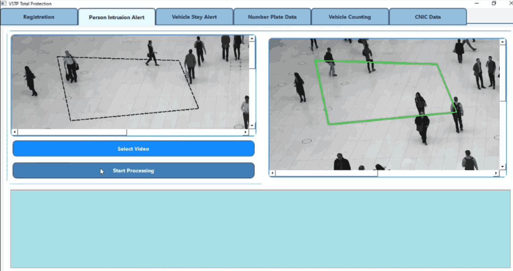

# Vision Sheild (Surveillance Project)

Vision Shield Advanced Surveillance Network for Total Protection (VSTP)

# 🚀 Vision Shield Advanced Surveillance Network for Total Protection (VSTP)

The **Vision Shield Advanced Surveillance Network for Total Protection (VSTP)** is an innovative security solution designed to enhance perimeter protection and access control using advanced camera technology and sophisticated algorithms. This cutting-edge system integrates multiple security functionalities into a unified platform, offering real-time monitoring, intrusion detection, vehicle tracking, and access management capabilities.

---

## 🎯 Objectives

In an era of escalating security challenges, traditional measures often fall short. VSTP addresses these gaps by providing:

- **Vigilant Eyes:** Advanced cameras strategically placed to monitor and detect potential threats.  
- **Intelligent Detection:** AI-powered algorithms to distinguish routine activities from security risks.  
- **Vehicle Vigilance:** Real-time vehicle counting, tracking, and anomaly detection.  
- **Identity Assurance:** CNIC (Computerized National Identity Card) verification for robust access control.  
- **Instant Alerts:** Real-time notifications via mobile and desktop applications.  
- **Centralized Command:** A user-friendly desktop interface for efficient management.  
- **Mobile Empowerment:** A powerful mobile app enabling remote monitoring and control.  

---

## 🌍 Socio-Economic Benefits

Surveillance technologies, with over **350 million cameras worldwide**, play a critical role in modern society. VSTP contributes by:

- Enhancing public safety.  
- Reducing crime through proactive monitoring.  
- Balancing security needs with privacy concerns.  
- Providing a scalable solution adaptable to smart homes, businesses, and critical infrastructure.  

---

## 🛠️ Methodologies

The VSTP project employs modern development practices and technologies:

- **Frontend Development:** Flutter for cross-platform mobile and desktop applications.  
- **Backend Development:** Python for scalable backend services and machine learning integration.  
- **Database Management:** Firebase Realtime Database for real-time data storage and synchronization.  
- **Computer Vision Integration:** OpenCV and YOLOv8 for intrusion detection and vehicle monitoring.  
- **Development Environment:** Visual Studio and Google Colab.  
- **Testing:** Unit testing, integration testing, and user acceptance testing.  
- **Deployment:** Windows platform with future potential for cross-platform support.  

---

## 📊 Outcomes

VSTP delivers significant value to stakeholders:

- **For Security Personnel:** Enhanced tools for intrusion detection, vehicle tracking, and identity verification.  
- **For Management:** Centralized control and instant notifications for swift decision-making.  
- **For Users:** Improved safety, privacy protection, and operational efficiency.  

---


## 📂 Repository Structure
```plaintext
├── frontend/      # Flutter code for mobile and desktop apps
├── backend/       # Python backend services
├── database/      # Firebase database configurations
├── models/        # Machine learning models (YOLOv8, OpenCV)
├── docs/          # Documentation and user guides
└── tests/         # Testing scripts and test cases
----
## 📲 Getting Started
#Prerequisites
#Python 3.x
#Flutter SDK
#Firebase account
#Visual Studio Code
#Installation
Clone the repository:
bash
Copy code
git clone https://github.com/yourusername/VSTP.git
Set up dependencies:
bash
Copy code
cd backend
pip install -r requirements.txt
Run the backend server:
bash
Copy code
python app.py
Launch the frontend:
bash
Copy code
cd ../frontend
flutter run
🤝 Contributing
We welcome contributions! Please follow our Contribution Guidelines.
---

## 📷 Screenshots

### Screenshot 1


### Screenshot 2


### Screenshot 3


### Screenshot 4


### Screenshot 5


